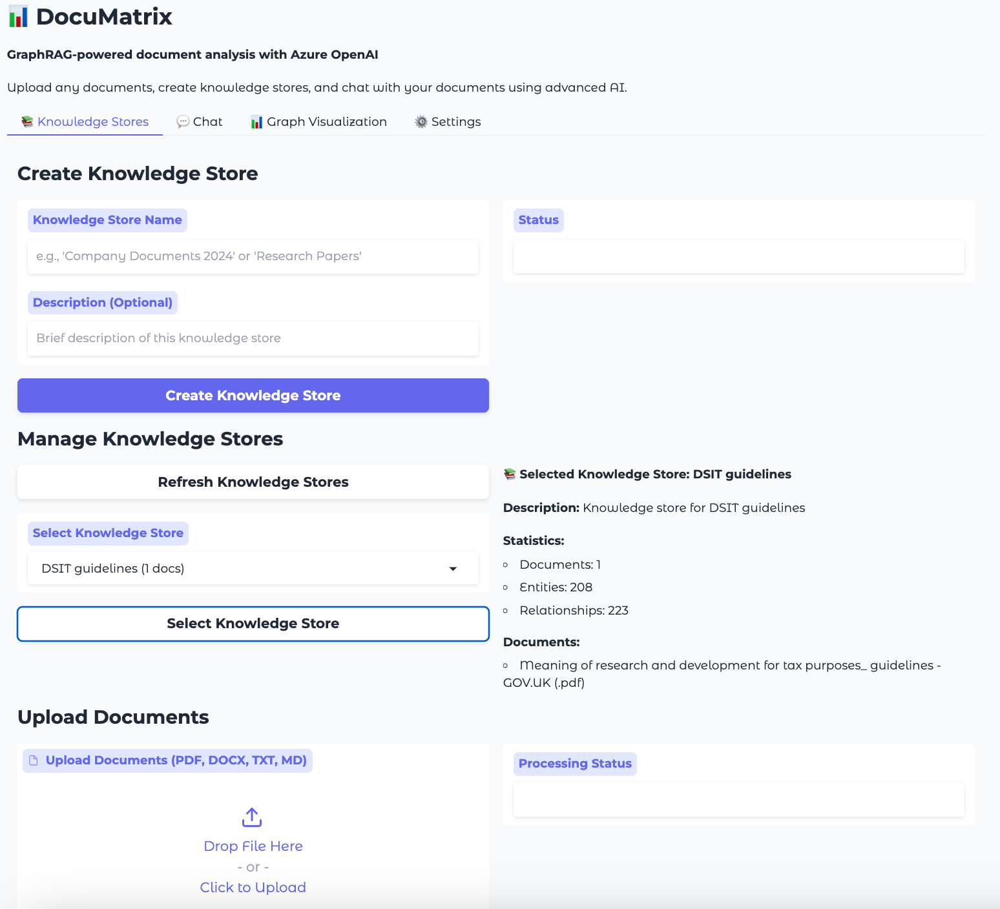
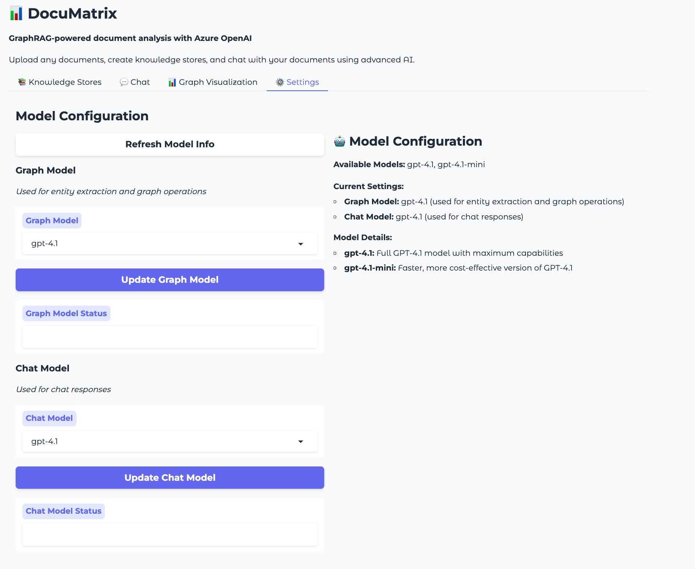
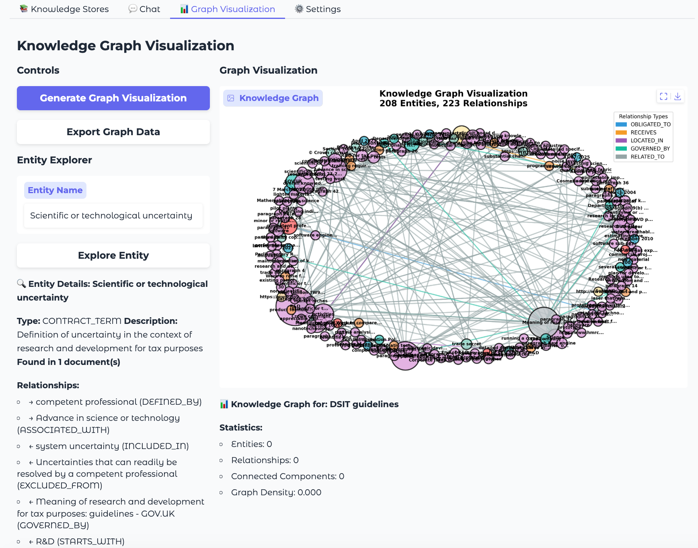
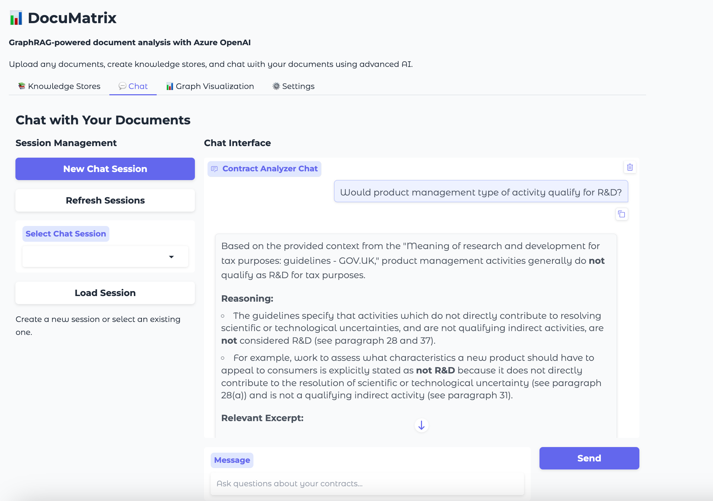
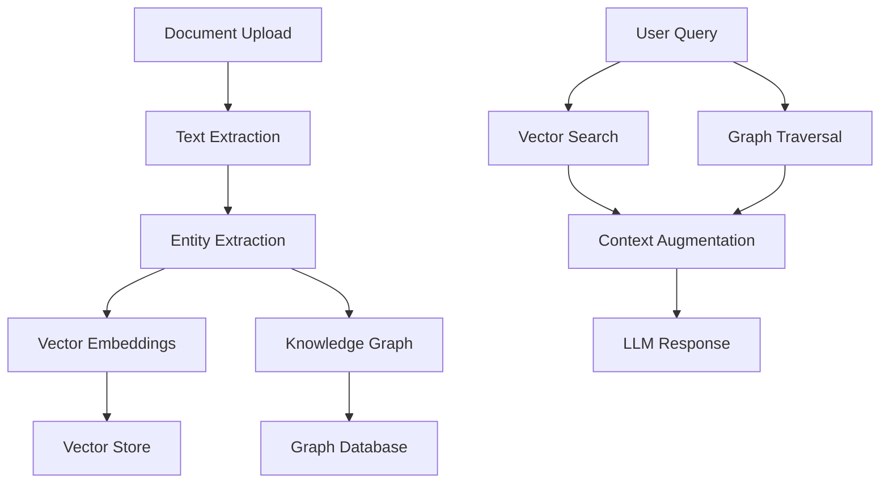

# DocuMatrix

<div align="center">
  
  
  
  
  <br>
  
  
  
  
</div>

A GraphRAG-powered document analysis application that combines vector search with graph traversal for intelligent document analysis and chat. Analyze any type of document - contracts, research papers, reports, and more.

###Special thanks and mention - Windsurf

## 📸 Screenshots

### Main Interface

*DocuMatrix's clean and intuitive interface with tabbed navigation*

### Model Selection

*Choose between GPT-4.1 and GPT-4.1-mini for different operations*

### Knowledge Graph Visualization

*Interactive knowledge graph showing entities and relationships*

### Chat Interface

*Natural language conversations with your documents*

## Features

🔍 **GraphRAG Technology**: Combines vector embeddings with knowledge graphs for enhanced retrieval  
📄 **Document Processing**: Supports PDF, DOCX, TXT, and Markdown files using MarkItDown  
🤖 **Azure OpenAI Integration**: Powered by GPT-4.1 and GPT-4.1-mini with model selection  
⚙️ **Model Selection**: Choose different models for graph operations vs chat responses  
💬 **Interactive Chat**: Natural language conversations with your documents  
📊 **Knowledge Graphs**: Automatic entity and relationship extraction using NetworkX  
🎯 **Vector Search**: Semantic search using ChromaDB and embeddings  
🌐 **Modern UI**: Clean Gradio interface with FastAPI backend  
🐳 **Container Ready**: Docker support for easy deployment

## Quick Start

### Prerequisites

- Python 3.11+
- UV package manager
- Azure OpenAI API access

### Installation

1. **Install dependencies**:
   ```bash
   uv sync
   ```

2. **Configure environment**:
   ```bash
   # Edit .env with your Azure OpenAI credentials
   ```

3. **Run the application**:
   ```bash
   uv run python -m contract_analyzer.main
   ```

   Access:
   - Gradio UI: http://localhost:7860
   - FastAPI docs: http://localhost:8000/docs

### Docker Deployment

```bash
docker-compose up --build
```

## Usage

1. **Create Knowledge Store**: Upload and process any documents (PDF, DOCX, TXT, MD)
2. **Model Selection**: Go to ⚙️ Settings tab to choose models:
   - **Graph Model**: For entity extraction and knowledge graph operations
   - **Chat Model**: For conversational responses
   - **Available Models**: GPT-4.1 (full capability) or GPT-4.1-mini (faster/cheaper)
3. **Chat Interface**: Ask questions about your documents using natural language
4. **Graph Visualization**: Explore extracted entities and relationships visually
5. **GraphRAG**: Get answers powered by both vector search and graph traversal

## Architecture

### System Overview

*High-level architecture showing the GraphRAG pipeline*

DocuMatrix uses a modular architecture with the following components:

- **Document Processing**: Extract text and metadata from various document formats
- **Entity Extraction**: Use LLMs to identify entities and relationships
- **Vector Store**: ChromaDB for semantic search capabilities
- **Graph Database**: NetworkX for relationship modeling and traversal
- **LLM Integration**: Azure OpenAI for natural language processing
- **Web Interface**: Gradio-based UI for user interaction

### Data Flow


### Technical Stack

- **Backend**: FastAPI with async support
- **Frontend**: Gradio web interface  
- **LLM**: Azure OpenAI (GPT-4.1 and GPT-4.1-mini with model selection)
- **Vector Store**: ChromaDB with persistence
- **Graph Database**: NetworkX for knowledge graphs
- **Document Processing**: MarkItDown for multi-format support
- **Graph**: NetworkX for relationship modeling
- **Package Management**: UV for fast dependency resolution
